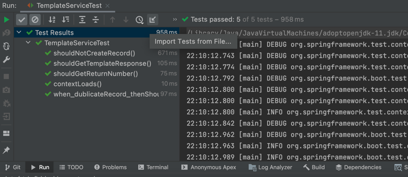
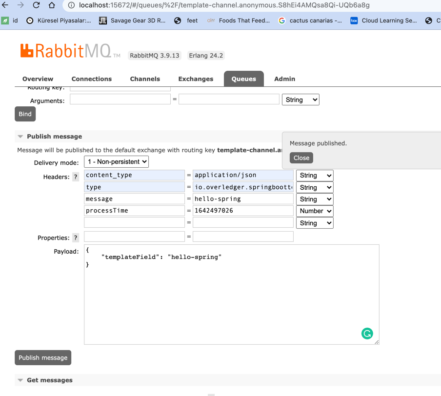

## Spring Cloud Stream & webflux (non-blocking I/O)

About The Project;

Spring Cloud Stream is a framework built on top of Spring Boot and Spring Integration that helps in creating event-driven or message-driven microservices.
Communication between endpoints is driven by messaging-middleware parties which is RabbitMQ. 
Services communicate by publishing domain events via these endpoints or channels.

WebFlux that supports non-blocking reactive streams for is providing a Reactive RESTful Web Service and It is fully non-blocking, supports Reactive Streams

need for a non-blocking web stack to handle concurrency with a small number of threads and scale with fewer hardware resources.
Servlet 3.1 did provide an API for non-blocking I/O.
Spring WebFlux moves away from the thread-per-request blocking model
Spring WebFlux will allow you to more efficiently leverage CPU and network resources,

Bindings — a collection of interfaces that identify the input and output channels declaratively
Binder — messaging-middleware implementation such as Kafka or RabbitMQ
Channel — represents the communication pipe between messaging-middleware and the application
StreamListeners — message-handling methods in beans that will be automatically invoked on a message from the channel after the MessageConverter does the serialization/deserialization between middleware-specific events and domain object types / POJOs

## The steps for the project are as follows.

First rabbitMq and Mongodb was run by DOCKER

was imported Service.postman_collection.json by POSTMAN

To use the Channel Handler, was uncommented out TemplateChannelHandler class

Fist TemplateOutputChannel used as an Output channel.

was commented out the rabbitmq.TemplateConfig class

was added spring-cloud-starter-stream-rabbit to pom.xml

removed --- from application.yml

1-)Post rest service called

2-)was seen that Created 2 records in MongoDB

3-) was commented out saveToDatabase method inside of postStuff method

4-)Thus, only the event captured over the channel was saved to MongoDB.(only one record)

5) for other use cases created TemplateServiceTest class

6-)then TemplateOutputChannel used as an Input channel.

7-) published a message over RabbitMq dashboard

8-)was seen that Created 1 records in MongoDB by consuming rabbitMq queue with MessageChannelHandler